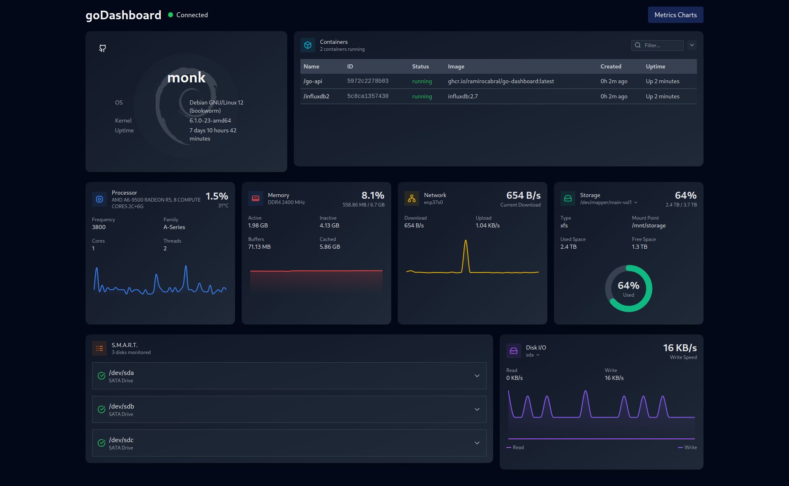
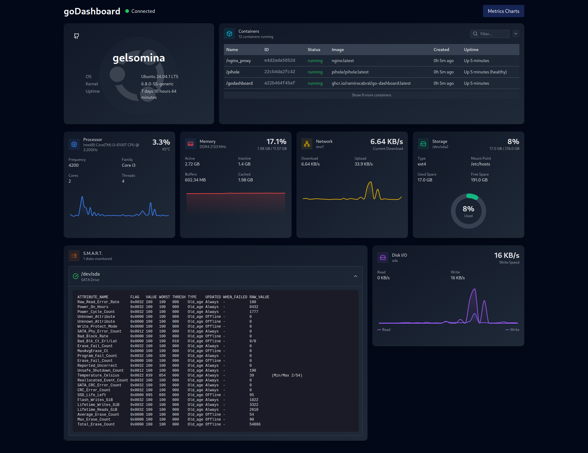

# goDashboard

## About

Este proyecto es un sistema de monitoreo en tiempo real para servidores, diseñado para recopilar y visualizar métricas de rendimiento como uso de CPU, memoria, I/O de disco y red. Utiliza una REST API desarrollada en Go y una interfaz web en ReactJS. Los datos históricos se almacenan en InfluxDB y se transmiten en tiempo real mediante WebSockets.



## Tecnologías utilizadas

- **Go**: Backend para la REST API y WebSockets.
- **ReactJS + TailwindCSS**: Interfaz de usuario para la visualización de métricas.
- **InfluxDB**: Base de datos optimizada para Timeseries.
- **WebSockets**: Comunicación en tiempo real entre el servidor y el frontend.
- **Docker**: Contenedores para la aplicación y base de datos.
- **GitHub Actions**: CI/CD para despliegue automatizado.

## Uso

### Crear un archivo `docker-compose.yaml` con el siguiente contenido:

```yaml
services:
  api:
    container_name: go-api
    image: ghcr.io/ramirocabral/go-dashboard:latest
    ports:
      - "8080:8080"
    environment:
      - DOCKER_API_VERSION=1.41
      - DB_ADDR="http://influxdb2:8086"
      - DB_TOKEN=${INFLUXDB_INIT_ADMIN_TOKEN}
      - DB_ORG=${INFLUXDB_INIT_ORG}
      - DB_BUCKET=${INFLUXDB_INIT_BUCKET}
    volumes:
      - /var/run/docker.sock:/var/run/docker.sock
      - /proc:/host/proc:ro
      - /sys:/host/sys:ro
      - /etc/os-release:/host/etc/os-release:ro
      - /etc/hostname:/host/etc/hostname:ro
      #you can add disks here to monitor SMART data
    depends_on:
      - influxdb2
    privileged: true
    restart: always

  influxdb2:
    container_name: influxdb2
    image: influxdb:2.7
    ports:
      - "8086"
    environment:
      - DOCKER_INFLUXDB_INIT_MODE=${INFLUXDB_INIT_MODE}
      - DOCKER_INFLUXDB_INIT_USERNAME=${INFLUXDB_INIT_USERNAME}
      - DOCKER_INFLUXDB_INIT_PASSWORD=${INFLUXDB_INIT_PASSWORD}
      - DOCKER_INFLUXDB_INIT_ORG=${INFLUXDB_INIT_ORG}
      - DOCKER_INFLUXDB_INIT_BUCKET=${INFLUXDB_INIT_BUCKET}
      - DOCKER_INFLUXDB_INIT_RETENTION=${INFLUXDB_INIT_RETENTION}
      - DOCKER_INFLUXDB_INIT_ADMIN_TOKEN=${INFLUXDB_INIT_ADMIN_TOKEN}
    volumes:
      - influxdb2:/var/lib/influxdb2
    restart: always

volumes:
  influxdb2:
```
### 2. Configurar variables de entorno

Crear un archivo `.env` basado en el archivo `.env.example` y configurar las variables de entorno necesarias:

``` bash
INFLUXDB_INIT_MODE=setup
INFLUXDB_INIT_USERNAME=admin
INFLUXDB_INIT_PASSWORD=SuperSecurePass1234
INFLUXDB_INIT_ORG=my-org
INFLUXDB_INIT_BUCKET=my-bucket
INFLUXDB_INIT_RETENTION=1D
INFLUXDB_INIT_ADMIN_TOKEN=mytoken
```

### 3. Ejecutar la aplicacion

Ejecutar el siguiente comando en la terminal:

```bash
docker-compose up -d
```

### 5. Acceder a la aplicación

Abre en el navegador:

```
http://localhost:8080
```
## Screenshots

### Dashboard


### Charts


## Contribuir

Si deseas contribuir, por favor abre un issue o un pull request en el repositorio.

## Licencia

Este proyecto está bajo la licencia GNU GPLv3. Para más información, ver el archivo `LICENSE`.