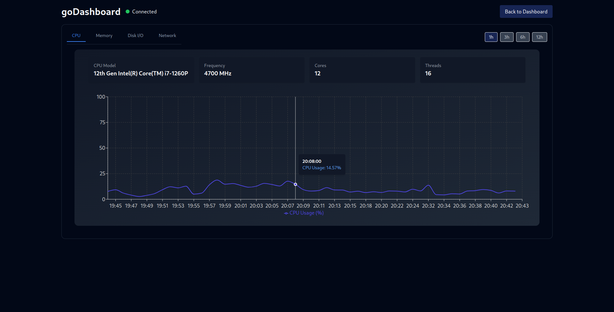

# goDashboard

## About
This project is a real-time monitoring system for Linux servers, designed to collect and visualize performance metrics such as CPU usage, memory, disk I/O, and network. It uses a REST API developed in Go and a web interface in ReactJS. Historical data is stored in InfluxDB and transmitted in real-time using WebSockets.


## Technologies used

- **Go**: Backend for the REST API and WebSockets.
- **ReactJS + TailwindCSS**: User interface for metrics visualization.
- **InfluxDB**: Database optimized for time series data.
- **WebSockets**: Real-time communication between the server and the client.
- **Docker**: Containers for the application and the database.
- **GitHub Actions**: CI/CD for automatic deployment.

## Installation prerequisites

- **Docker**: [Install Docker](https://docs.docker.com/get-docker/)
- **Docker Compose**: [Install Docker Compose](https://docs.docker.com/compose/install/)

## Usage

### 1. Create a `docker-compose.yaml` file with the following content:

```yaml
services:
  api:
    container_name: go-api
    image: ghcr.io/ramirocabral/go-dashboard:latest
    ports:
      - "8080:8080"
    environment:
      - DOCKER_API_VERSION=1.41
      - DB_ADDR="http://influxdb2:8086"
      - DB_TOKEN=${INFLUXDB_INIT_ADMIN_TOKEN}
      - DB_ORG=${INFLUXDB_INIT_ORG}
      - DB_BUCKET=${INFLUXDB_INIT_BUCKET}
    volumes:
      - /var/run/docker.sock:/var/run/docker.sock
      - /proc:/host/proc:ro
      - /sys:/host/sys:ro
      - /etc/os-release:/host/etc/os-release:ro
      - /etc/hostname:/host/etc/hostname:ro
      #you can add disks here to monitor SMART data
    depends_on:
      - influxdb2
    privileged: true
    restart: always

  influxdb2:
    container_name: influxdb2
    image: influxdb:2.7
    ports:
      - "8086"
    environment:
      - DOCKER_INFLUXDB_INIT_MODE=${INFLUXDB_INIT_MODE}
      - DOCKER_INFLUXDB_INIT_USERNAME=${INFLUXDB_INIT_USERNAME}
      - DOCKER_INFLUXDB_INIT_PASSWORD=${INFLUXDB_INIT_PASSWORD}
      - DOCKER_INFLUXDB_INIT_ORG=${INFLUXDB_INIT_ORG}
      - DOCKER_INFLUXDB_INIT_BUCKET=${INFLUXDB_INIT_BUCKET}
      - DOCKER_INFLUXDB_INIT_RETENTION=${INFLUXDB_INIT_RETENTION}
      - DOCKER_INFLUXDB_INIT_ADMIN_TOKEN=${INFLUXDB_INIT_ADMIN_TOKEN}
    volumes:
      - influxdb2:/var/lib/influxdb2
    restart: always

volumes:
  influxdb2:
```

### 2. Configure environment variables

Create an `.env` file based on the `.env.example` file and configure the necessary environment variables:

Example:
``` bash
INFLUXDB_INIT_MODE=setup
INFLUXDB_INIT_USERNAME=admin
INFLUXDB_INIT_PASSWORD=SuperSecurePass1234
INFLUXDB_INIT_ORG=my-org
INFLUXDB_INIT_BUCKET=my-bucket
INFLUXDB_INIT_RETENTION=1D
INFLUXDB_INIT_ADMIN_TOKEN=mytoken
```

### 3. Run the application

Execute the following command in the terminal:

```bash
docker-compose up -d
```

### 4. Access the application

Open your browser and access the following URL:

```
http://localhost:8080
```
When running it on a server, replace `localhost` with the server's IP address and make sure the port is open in the firewall.
## Screenshots

### Dashboard


### Charts



## Contributing

If you wish to contribute to the project, please open an issue or submit a pull request in the repository.

## License

This project is under the GNU GPLv3 license. For more information, see the `LICENSE` file.